- 👋 Hi, I’m @mj9
- 👀 I’m interested in Deep Learning, Computer Vision, Java, Task Automation

<!--- 🌱 I’m currently learning Deep Learning
- 💞️ I’m looking to collaborate on ...
- 📫 How to reach me ...
--->

# My projects

## 2015

| Map Editor |
|--|
| 
 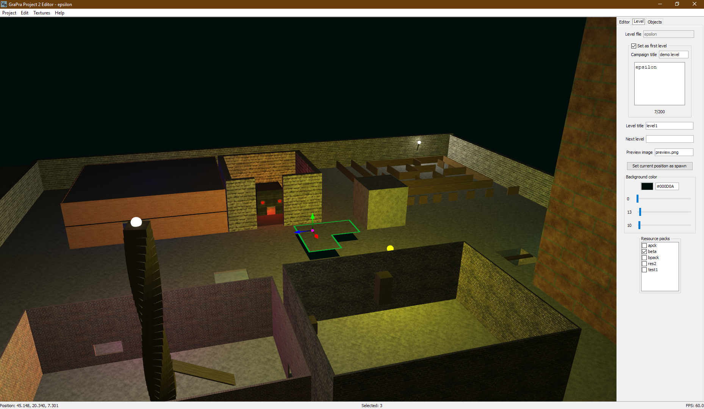 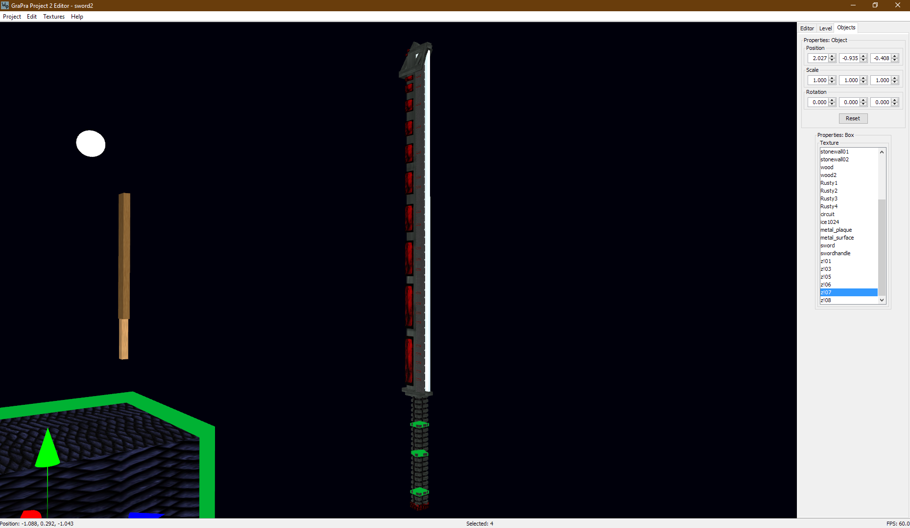 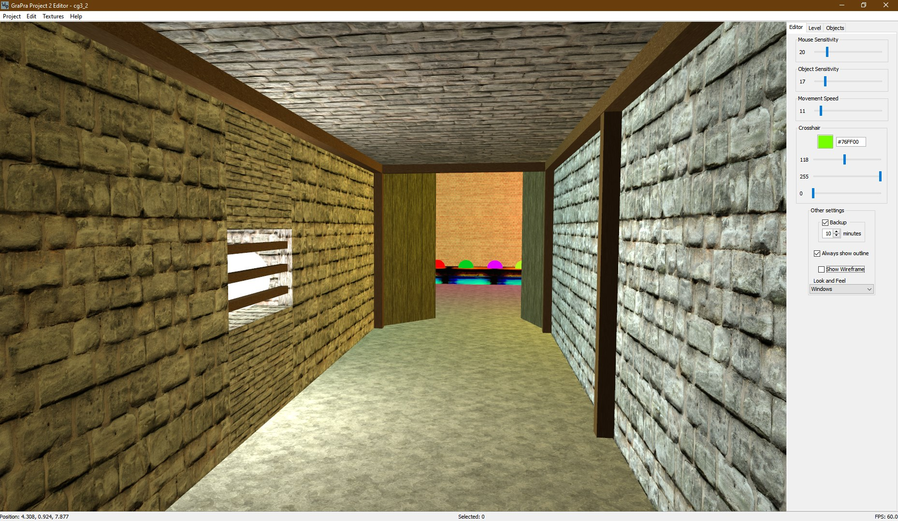
        A crude map and object editor for primitives (boxes and spheres), written in `Java` and `OpenGL`. Although somewhat cumbersome, it greatly improves from the most basic low-level graphics workflow, where one enters object transformations by hand. This was made in tandem with another student, who created a separate game engine. We created a common file format (with compression) for maps, that can be loaded by the game engine. Custom textures can be added by anyone designing their own maps. We aimed to extend this beyond the uni project, and turn it into a full game with story, enemies, objectives and sword combat, but after many planning sessions it became apparent that our vision would require years to accomplish. |

| VelcroDB | Misc |
|--|--|
| 
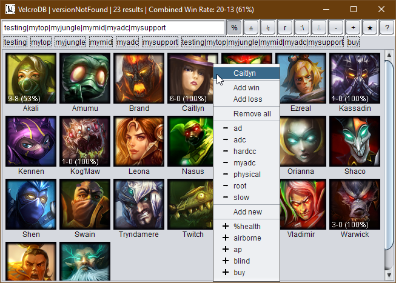
       This is the successor to [LoL Pick List](#2014), improving some of its flaws. The name is an intentionally bad spelling of Vel'koz, whose purpose is to gain knowledge. The prior tool was difficult to maintain because all champions were added by hand. VelcroDB checks the registry for the game installation directory, then takes all champions directly from the game files. It is also not restricted to the five predefined tags, allowing the user to fully customize tags. Tags can be easily added via suggested tags in the context menu, or with the quick tag mode where a selected tag can be added to any champ with a single click. The first item in the context menu opens a wiki page to help determine appropriate tags. There is now a search bar with *and/not/or* functionality and auto-completion. This allows to make the perfect pick to suit a given matchup, e.g. searching "*hardcc&physical*". Any search can be pinned. Win rate statistics are also easily added and displayed with an overlay. |        **Nut classifier**  A uni project with the goal to classify trail mix contents in photos. Written in `C++` with `OpenCV`, it first segments all objects, computes handcrafted features, then from a few clicked objects learns to assign classes (using NN/kNN/linear classifier).       **Mini Smart Home** team project where my part was designing an `Android` app to monitor Bluetooth sensor data and offer controls.         **Medical image processing** group project where my part was to read a dataset saved in an archaic lossless-JPEG format from the year 2000.

## 2014

| Game of Life | Misc |
|--|--|
| 

      For a university project I was in a team tasked to replicate this classical German board game. I designed the frontend with `JS` and `CSS` Animations, including all artwork (except for background sprites, i.e. trees and houses). The spinner for instance is created entirely in CSS. The browser shows the section of the board that is currently active. Player figures (family cars with space for up to six people) move smoothly across the track. The spinner animates the rolls that are given by the backend. An event log tracks the state of the game. This game was fully playable for multiple human and AI players. |      **Giveaway Browser** 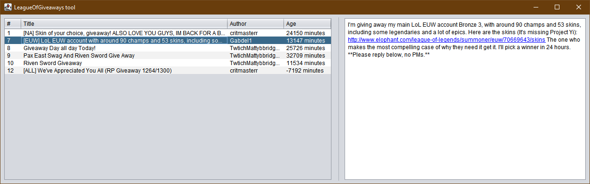 simple filtered view of a subreddit that keeps refreshing.      **Snake Game** 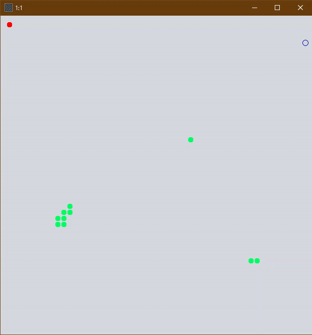 proof of concept for a very simple game loop with rules. |

| LoL Pick List | Snake Draw |
|--|--|
|
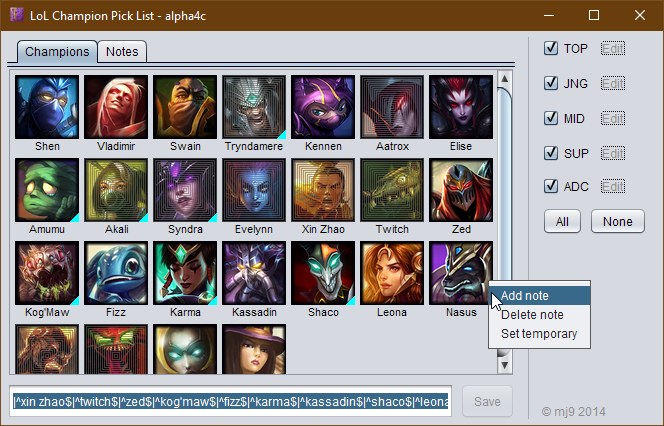
      To help create and maintain a diverse champion pool in the game, I created this (I used to main fill as a role). For each role, a number of champions can be picked. Notes can be attached to them and show as tooltips (indicated in bottom right corner). The semi-opaque overlay can be used to mark tentative additions to the champ pool. The current selection is also copied to the clipboard (bottom text field), to be pasted into the in-game champion search. | 
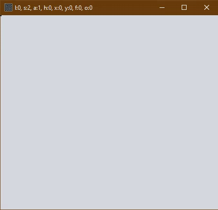
      I used to draw patterns made from a single line on paper. This is the first creative tool I developed. The line moves on a fixed grid, which is drawn to a canvas. It can be saved and loaded, and undo functionality allows to fix mistakes, such as when the head gets stuck in a dead end. |

## 2013

| Livestreamer Tool | Series Scheduler |
|--|--|
|
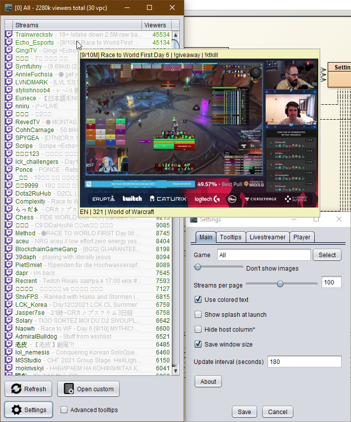
    This was inspired by a browser extension called [LoL Stream Browser](https://chrome.google.com/webstore/detail/lol-stream-browser/edidfaijmhpefkbnobdcepampbncgejp?hl=en). I made this tool for myself (and one friend), to discover livestreams on Twitch, Azubu and YouTube all in one place. Unlike the simple browser extension, this offered preview images of the streams. Streams can be opened via their webpage, or using *Livestreamer* (now maintained as *Streamlink*), which can open the streams directly in VLC player. Different game categories can be browsed efficiently, one page (100 streams) at a time. The advanced tooltips show all available data from the Twitch API, such as profile picture, creation date and partner status. I developed the tool until 2015 (screenshot taken in 2021). | 
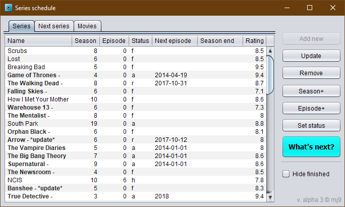
      Initially I used a .txt file to keep track of all the series I watch. It was cumbersome to edit text anytime an episode is finished, so I created this tool that requires just one click. The data is backed by a `MySQL` database. The tool also reminds you to keep information up to date. For instance, if the current date is past the specified season end, it reminds you to check new episodes. |

| Turtle Blueprints | DNS Changer | Misc |
|:--|--|--|
|

     Turtles are robots from the Computercraft mod for Minecraft. They can be programmed in the game to move around and place blocks. This can be easily used to build predefined structures, however typing a building blueprint by hand is difficult. I made a simple tool with a graphical interface for that, that can also upload the blueprint script to Pastebin. | 
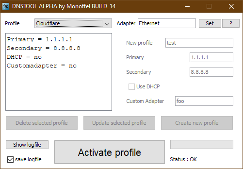
     A tool that stores DNS profiles that can be switched between with a click. Additionally it could fetch IPs from a smart DNS website. | **Big file reader** 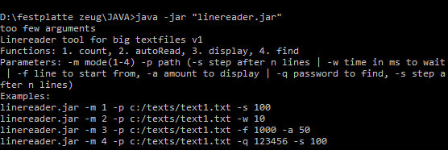 command-line tool to efficiently search through very large text files.       **Online shop demo** backed by `PHP/SQL`, frontend with `HTML/CSS/JS`. |

## 2012

| LAN Food Delivery List v1 (2009) | LAN Food Delivery List v2 |
|--|--|
| 
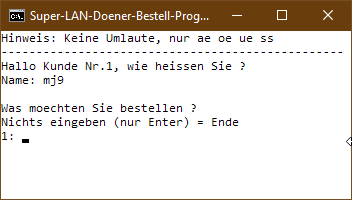
    Originally the idea came up in 2009, because it took a long time to get everyone's food order at LAN events. In an attempt to solve this, I made a `batch` script that everyone could open, type their name and order in, and it would be appended to a log file on a local host. | 
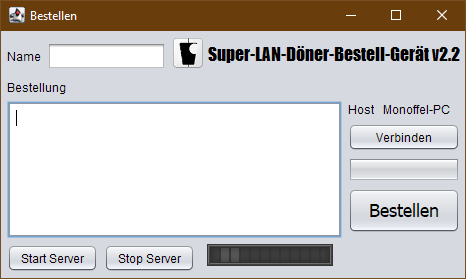
    One of the first apps I made in `Java` was a GUI version of this tool. Instead of the Windows file system, it used sockets to connect to a local network host. The tool was made in the BlueJ editor, using the `Stifte und Mäuse` library for Java beginners, for GUI and Networking. |
