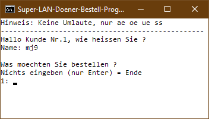
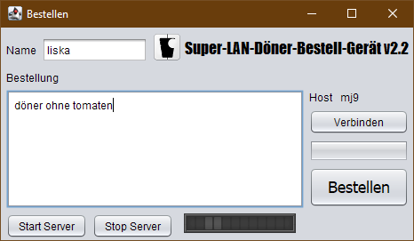

- 👋 Hi, I’m @mj9
- 👀 I’m interested in Deep Learning, Computer Vision, Java, Task Automation

<!--- 🌱 I’m currently learning Deep Learning
- 💞️ I’m looking to collaborate on ...
- 📫 How to reach me ...
--->

# My projects

## 2013

| Livestreamer Tool | Series Scheduler |
|--|--|
|

    This was inspired by a browser extension called [LoL Stream Browser](https://chrome.google.com/webstore/detail/lol-stream-browser/edidfaijmhpefkbnobdcepampbncgejp?hl=en). I made this tool for myself (and one friend), to discover livestreams on Twitch, Azubu and YouTube all in one place. Unlike the simple browser extension, this offered preview images of the streams. Streams can be opened via their webpage, or using Livestreamer (now maintained as Streamlink), which can open the streams directly in VLC player. Different game categories can be browsed efficiently, one page (100 streams) at a time. The advanced tooltips show all available data from the Twitch API, such as profile picture, creation date and partner status. I developed the tool until 2015 (screenshot taken in 2021). | 

     Initially I used a .txt file to keep track of all the series I watch. It was cumbersome to edit text anytime an episode is finished, so I created this tool that enabled this with just one click. The data is backed by a MySQL database. The tool also reminds you to keep information up to date. For instance, if the current date is past the specified season end, it reminds you to check new episodes.  |

| Turtle Blueprints | DNS Changer |
|--|--|
|

     Turtles are robots from the Computercraft mod for Minecraft. They can be programmed in the game to move around and place blocks. This can be easily used to build predefined structures, however typing a building blueprint by hand is difficult. I made a simple tool with a graphical interface for that, that can also upload the blueprint script to Pastebin. | 

     A tool that stores DNS profiles that can be switched between with a click. Additionally it could fetch IPs from a smart DNS website.  |

## 2012

| LAN Food Delivery List v1 (2009) | LAN Food Delivery List v2 |
|--|--|
| 

    Originally the idea came up in 2009, because it took a long time to get everyone's food order at LAN events. In an attempt to solve this, I made a batch script that everyone could open, type their name and order in, and it would be appended to a log file on a local host. | 

    One of the first apps I made in Java was a GUI version of this tool. Instead of the Windows file system, it used sockets to connect to a local network host. The tool was made in the BlueJ editor, using the `Stifte und Mäuse` library for Java beginners, for GUI and Networking. |

<!---
mj9/mj9 is a ✨ special ✨ repository because its `README.md` (this file) appears on your GitHub profile.
You can click the Preview link to take a look at your changes.
--->
