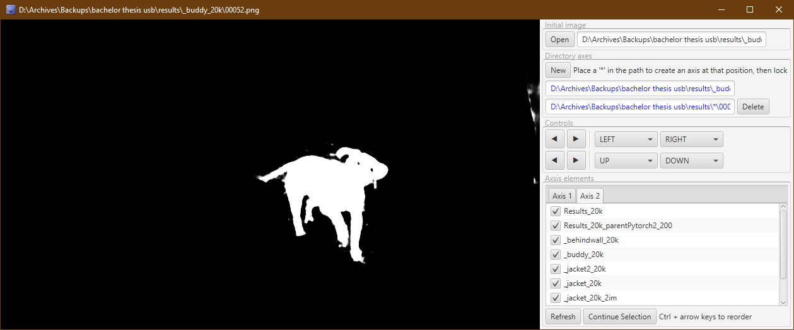
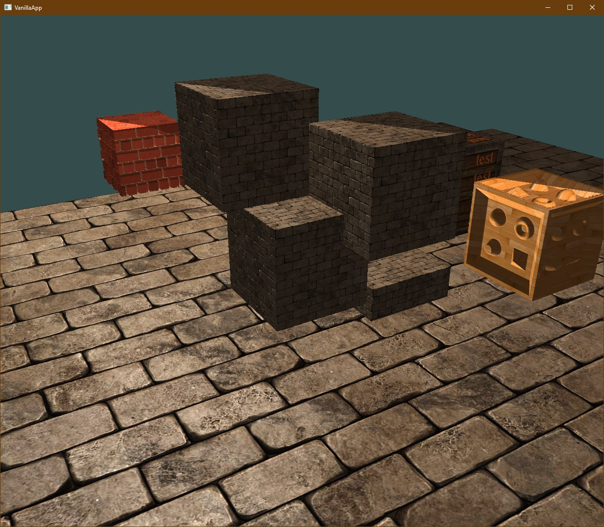
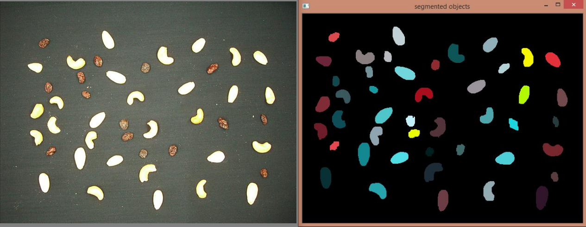
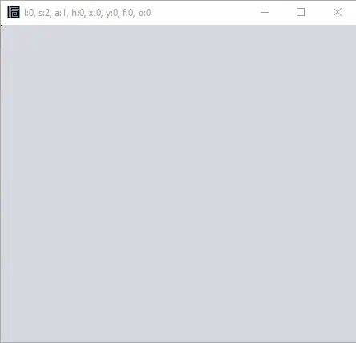
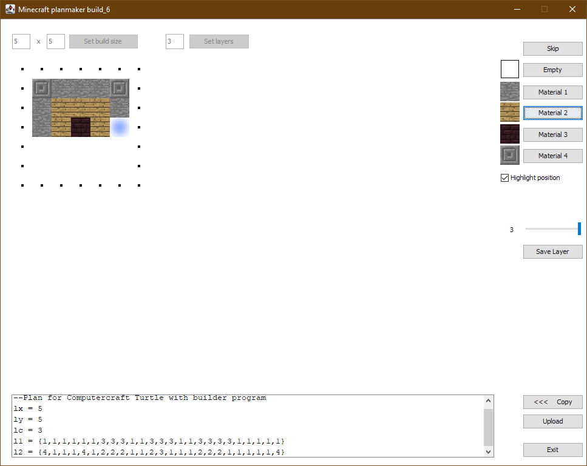

- 👋 Hi, I’m @mj9
- 👀 I’m interested in Deep Learning, Computer Vision, Java, Functional Programming, Task Automation, Game Design

<!---
- 🌱 I’m currently learning ...
- 💞️ I’m looking to collaborate on ...
- 📫 How to reach me ...
--->

My writing
==========

## 2021

- *Master Thesis:* [Blur Kernel Estimation by Deep Learning](papers/Kernel-Estimation.pdf)

## 2019

- *Bachelor Thesis:* [Video Object Segmentation with Deep Learning](papers/Video-Object-Segmentation.pdf)
- *Seminar Paper:* [From Multi-Layer Depth Peeling to Efficient Order-Independent Transparency](papers/Multi-Layer-Depth-Peeling.pdf)

My projects
===========

## 2021

⚠ Under Construction ⚠

- [main] kernel estimation network

## 2020

⚠ Under Construction ⚠

- [main] windowrobot
- [main] playlist dl

- [misc] filesplitter
- [side] privatebin uploader

## 2019

⚠ Under Construction ⚠

- [main] high speed imaging  

- [main] giveaway paster
- [side] Zork Bot

- [side] dungeon map
- [misc] ImageNet downloader
- [misc] Obfuscator v2
- [misc] SYI scraper/crawler
- [misc] java image processing
- [misc] repl / regex rename

## 2018

| YtApp | Misc |
|--|--|
| 

      A proof of concept for scraping and merging YouTube channel pages, specialised for Music. | **Unitypatcher**        byte manipulation tool   **TimeDifference**       utility for date and time calculations   **GükoScraper**        a web scraper to extract job listings from a website into CSV format   **WinOgerUtil** Java library for Windows specific features (flashing taskbar icons, taskbar progress bars and window titles)   **SequenceViewer**       image viewer for large scale qualitative image comparison |

## 2017

| Virtual Self |
|--|
| Soon™ |

| MouseChart | Misc |
|--|--|
| 

     If you spend a lot of time on a computer, you may sometimes wonder what you did all day. To answer this question, this tool tracks your activity (mouse movements, and active window titles) and plots it. In addition to a broad overview, every single minute can be viewed, and summaries can be created. This also serves as somewhat of a diary, since you can go back to any point in time and see what you did. The activity log files are also made to be human-readable, so that all detailed information can be viewed at a glance, with an editor of your choice. | **CUDA string matching**       GPU implementation of the Rabin/Karp algorithm.   **Atom unicode snippets**       Java tool to query (mathematical) unicode characters and make them typeable in the Atom text editor.   **File sequence parser**       intelligently detects numbering sequences in filenames and integrates into the Windows explorer context menu to run a configurable command on the sequence.   **Game networking library**  uses Java SSL sockets and java.io Streams to transport data and events (Objects) securely over network. |

| Fake Process Builder | Script Timer |
|--|--|
| 

      An interesting security concept is that malware does not want to run in environments where it could be analysed. So by creating fake processes that mimic common analysis and reverse-engineering tools, potential malware may decide to not even run your system. Although I am not the first to implement this idea, prior solutions simply renamed existing executable files. This may incur a performance hit, but also the executable metadata (such as the title) can be used to identify the original file name and author. To alleviate this, my solution creates custom process metadata (including icon) for every process. New processes can be added to the list and will automatically be compiled into executables when the app runs. | 

       A simple timer that stores and runs shell scripts. I use this mostly to turn off the computer while I am away or asleep, or to remind myself when a pizza is done. It also shows the progress in the Windows taskbar, which is not native to JavaFx. |

## 2016

| FxTwitch |
|--|
| 

 As the successor to my previous [livestreaming app](#2013), this can play streams in-app. It is also built with `JavaFx`, and thus offers a rich interface with CSS styles (used for the dark theme). Another addition is that several game categories can be shown simultaneously, while also being searchable. Stream discovery is further streamlined with high resolution preview images, that are preloaded and transition smoothly into playback. Discovery is highly customizable with multi-tier favorites, individual or whole category ignores, as well as language and rerun filters. I have been using this app daily for over 4 years, so a lot of development time has also gone into it. Playback is handled by LibVLC, via [vlcj](https://github.com/caprica/vlcj). |

| Chat Bot | Advanced Rendering Demo |
|--|--|
| 
 
        A chat bot for Twitch, developed in `Java`, using on [PircBotX](https://github.com/pircbotx/pircbotx). I actively worked on it over 3 years, with over 150 commands and over 50,000 usages in a small community. It is hosted on a `RaspberryPi`, specifically for this project. At large this is a tool for chatters to use, offering chat statistics, access to web APIs, moderation, games, text tools, communication tools and more. But it also delivers public mail. 

<code>Background</code>
        While common bots are made for content creators (streamers), this one is made for chatters. All coding is done by me, but the community is closely involved in many design decisions. What is unique about this project is that every feature can be put immediately into a production environment, with direct feedback. This allowed me to learn what users find intuitive or engaging, often defeating my expectations. Note that names have been changed in the image.
  |  
 
       This demo aims to implement parallax mapping, normal mapping and shadow maps. Note that every surface is actually flat—the illusion of depth comes from parallax mapping (lowering geometry) and normal mapping (lighting effects). More importantly, this is a `JavaFx` app with custom `OpenGL` integration, which has been a notorious shortcoming of native JavaFx. |

| [Going Home](https://youtu.be/eJYUSHXGv90) | Maya Render Util |
|--|--|
| 

        An almost 3 minute long animation I made with Autodesk `Maya`, consisting of 4000 frames. Everything is made from scratch: models, character, rigging, animations, texture mapping, and generated textures. Only image textures for the exterior were pre-existing. *This project may not seem relevant to my career, but this was one of the most challenging things I have ever done. The work ethic required to drive this to a (timely) completion pushed my limits more than any other project. The full-time work on this was about eight months, demanding me to constantly learn, conceive creative solutions, and put in many hours.* | 

       A utility to render all frames for multiple cameras in a Maya scene file. This was used to efficiently distribute the complex render job to a pool of available desktops. 

<code>Background</code>
       
Consider the fact that one frame can take up to ten minutes to render. This alone would take over 600 hours in total. Since I had a pool of around 20 desktop computers available, I could distribute the rendering to multiple computers. They could render to a network drive, and the renderer automatically skips frames that already exist. So given a render job, this already distributes the work perfectly. However at the time, the default renderer (mental ray) only allowed a single camera to render, and I had twelve. So I would have to start render jobs on *all* machines twelve times. Since I cannot be at the university's PC pool at all times, the effort and total render time would be much higher. I could give every machine a different camera to render, but they have a different number of frames, again leaving much potential computation time wasted. This workflow is also prone to manual error, a single of which can ruin an entire batch of frames.

         After being unable to make a "super camera" work (that would combine several cameras into one), I decided to create a tool that just queues up several render jobs in sequence. Although this was made in 2017, it sits next to the relevant project. Using the MEL scripting language from Maya (which I largely learned just for this tool), the tool would extract all camera information and render settings from a scene file, and run a render job for each. The tool is then started once on every machine, and the entire complex rendering job is fully distributed. I even added a shutdown command to turn off the PCs after the job was done. This allowed me to go there on a Friday afternoon, start the job, and come back Monday with all frames rendered.
     Note that in principle this tool could have been very useful to other students, or anyone working with Maya, but after years of using mental ray, the next Maya version introduced a new renderer (Arnold). This is also why it is no longer working in the image (taken in 2021 with Maya 2018). 
 |

| OgerUtil | Misc |
|--|--|
| 

         Over the years I started using the same code in multiple projects, and collected it as a library in this project. As of 2021, it has 10,000 lines of code (counting only [logic](https://stackoverflow.com/a/18729918/6371453)). This library is used in almost every of my `Java` projects. It contains functions for string manipulation, unicode tools, logging, HTTP client abstraction, HTML/XML parsers, web APIs and scrapers, time-based collections, threading abstraction, persistence tools, custom `JavaFx` controls, shell abstractions, and more. For instance, all recent GUI layouts (JavaFx) are created with the *VBuilder* class. The image shows size of OgerUtil components, visualized using SpaceSniffer. | **Typing Test**  tool to practice typing speed / accuracy.   **Obfusca-tor v1**        to hide plaintext API keys in source code. |

## 2015

| Map Editor |
|--|
| 
   
       A crude map and object editor for primitives (boxes and spheres), written in `Java` and `OpenGL`. Although somewhat cumbersome, it greatly improves from the most basic low-level graphics workflow, where one enters object transformations by hand. This was made in tandem with another student, who created a separate game engine. We created a common file format (with compression) for maps, that can be loaded by the game engine. Custom textures can be added by anyone designing their own maps. We aimed to extend this beyond the uni project, and turn it into a full game with story, enemies, objectives and sword combat, but after many planning sessions it became apparent that our vision would require years to accomplish. |

| VelcroDB | Misc |
|--|--|
| 

       This is the successor to [LoL Pick List](#2014), improving some of its flaws. The name is an intentionally bad spelling of Vel'koz, whose purpose is to gain knowledge. The prior tool was difficult to maintain because all champions were added by hand. VelcroDB checks the registry for the game installation directory, then takes all champions directly from the game files. It is also not restricted to the five predefined tags, allowing the user to fully customize tags. Tags can be easily added via suggested tags in the context menu, or with the quick tag mode where a selected tag can be added to any champ with a single click. The first item in the context menu opens a wiki page to help determine appropriate tags. There is now a search bar with *and/not/or* functionality and auto-completion. This allows to make the perfect pick to suit a given matchup, e.g. searching "*hardcc&physical*". Any search can be pinned. Win rate statistics are also easily added and displayed with an overlay. |        **Nut classifier**  A uni project with the goal to classify trail mix contents in photos. Written in `C++` with `OpenCV`, it first segments all objects, computes handcrafted features, then from a few clicked objects learns to assign classes (using NN/kNN/linear classifier).       **Mini Smart Home** team project where my part was designing an `Android` app to monitor Bluetooth sensor data and offer controls.         **Medical image processing** group project where my part was to read a dataset saved in an archaic lossless-JPEG format from the year 2000.

## 2014

| Game of Life | Misc |
|--|--|
| 

      For a university project I was in a team tasked to replicate this classical German board game. I designed the frontend with `JS` and `CSS` Animations, including all artwork (except for background sprites, i.e. trees and houses). The spinner for instance is created entirely in CSS. The browser shows the section of the board that is currently active. Player figures (family cars with space for up to six people) move smoothly across the track. The spinner animates the rolls that are given by the backend. An event log tracks the state of the game. This game was fully playable for multiple human and AI players. |      **Giveaway Browser**  simple filtered view of a subreddit that keeps refreshing.        **Snake Game**  proof of concept for a very simple game loop with rules. |

| LoL Pick List | Snake Draw |
|--|--|
|

      To help create and maintain a diverse champion pool in the game, I created this (I used to main fill as a role). For each role, a number of champions can be picked. Notes can be attached to them and show as tooltips (indicated in bottom right corner). The semi-opaque overlay can be used to mark tentative additions to the champ pool. The current selection is also copied to the clipboard (bottom text field), to be pasted into the in-game champion search. | 

      I used to draw patterns made from a single line on paper. This is the first creative tool I developed. The line moves on a fixed grid, which is drawn to a canvas. It can be saved and loaded, and undo functionality allows to fix mistakes, such as when the head gets stuck in a dead end. |

## 2013

| Livestreamer Tool | Series Scheduler |
|--|--|
|

    This was inspired by a browser extension called [LoL Stream Browser](https://chrome.google.com/webstore/detail/lol-stream-browser/edidfaijmhpefkbnobdcepampbncgejp?hl=en). I made this tool for myself (and one friend), to discover livestreams on Twitch, Azubu and YouTube all in one place. Unlike the simple browser extension, this offered preview images of the streams. Streams can be opened via their webpage, or using *Livestreamer* (now maintained as *Streamlink*), which can open the streams directly in VLC player. Different game categories can be browsed efficiently, one page (100 streams) at a time. The advanced tooltips show all available data from the Twitch API, such as profile picture, creation date and partner status. I developed the tool until 2015 (screenshot taken in 2021). | 

      Initially I used a .txt file to keep track of all the series I watch. It was cumbersome to edit text anytime an episode is finished, so I created this tool that requires just one click. The data is backed by a `MySQL` database. The tool also reminds you to keep information up to date. For instance, if the current date is past the specified season end, it reminds you to check new episodes. |

| Turtle Blueprints | DNS Changer | Misc |
|:--|--|--|
|

     Turtles are robots from the Computercraft mod for Minecraft. They can be programmed in the game to move around and place blocks. This can be easily used to build predefined structures, however typing a building blueprint by hand is difficult. I made a simple tool with a graphical interface for that, that can also upload the blueprint script to Pastebin. | 

     A tool that stores DNS profiles that can be switched between with a click. Additionally it could fetch IPs from a smart DNS website. | **Big file reader**  command-line tool to efficiently search through very large text files.       **Online shop demo** backed by `PHP/SQL`, frontend with `HTML/CSS/JS`. |

## 2012

| LAN Food Delivery List v1 (2009) | LAN Food Delivery List v2 |
|--|--|
| 

    Originally the idea came up in 2009, because it took a long time to get everyone's food order at LAN events. In an attempt to solve this, I made a `batch` script that everyone could open, type their name and order in, and it would be appended to a log file on a local host. | 

       One of the first apps I made in `Java` was a GUI version of this tool. Instead of the Windows file system, it used sockets to connect to a local network host. The tool was made in the BlueJ editor, using the `Stifte und Mäuse` library for Java beginners, for networking and NetBeans to build the GUI. Unlike the previous version, it did not have problems with encoding special characters, and was robust to connection errors. |
